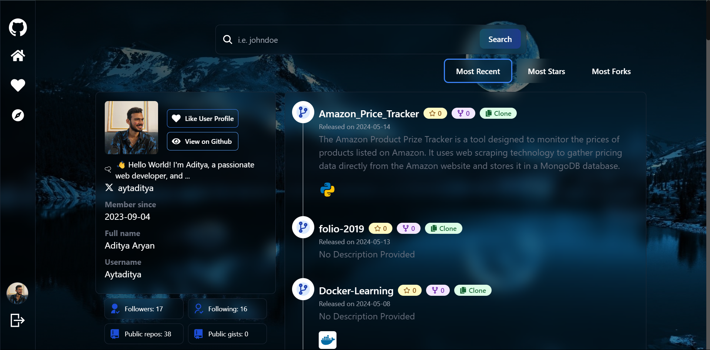

# GitForge Web Application


## Overview

This project is a GitHub-inspired web application built using the MERN stack (MongoDB, Express.js, React, Node.js), Tailwind CSS, and the GitHub API. It includes Docker integration for containerization and uses Passport.js for GitHub-based user authentication. Additionally, the application features a profile liking system and a repository exploration section.

## Features

- **MERN Stack**: MongoDB for the database, Express.js for the backend framework, React for the frontend framework, and Node.js for the runtime environment.
- **Tailwind CSS**: A utility-first CSS framework for styling.
- **GitHub API Integration**: Fetch and display data from GitHub.
- **Docker Integration**: Containerization of the application for consistent development and deployment environments.
- **GitHub Authentication**: Secure user authentication via GitHub using Passport.js.
- **Profile Liking System**: Users can like each other's profiles.
- **Repository Exploration**: Explore the top 30 most liked repositories in JavaScript, TypeScript, C#, Python, Go, Flutter, Dart, Java, C++, and Swift.





## Installation

### Prerequisites

- Node.js
- Docker
- MongoDB
- GitHub OAuth App credentials

### Steps

1. **Clone the Repository**
    ```bash
    git clone https://github.com/your-username/github-inspired-app.git
    cd github-inspired-app
    ```

2. **Set Up Environment Variables**

    Create a `.env` file in the root directory with the following content:
    ```env
    PORT=3000
    MONGODB_URI=mongodb://localhost:27017/github-inspired-app
    GITHUB_CLIENT_ID=your_github_client_id
    GITHUB_CLIENT_SECRET=your_github_client_secret
    SESSION_SECRET=your_session_secret
    ```

3. **Install Dependencies**

    ```bash
    npm install
    cd client
    npm install
    cd ..
    ```

4. **Run the Application with Docker**

    Ensure Docker is installed and running, then execute:
    ```bash
    docker-compose up --build
    ```

5. **Run the Application without Docker**

    If you prefer running the application without Docker:
    ```bash
    # Start MongoDB if not already running
    mongod

    # Start the backend server
    npm run server

    # In another terminal, start the frontend development server
    cd client
    npm run dev
    ```

## Usage

1. **Visit the Application**

    Open your web browser and navigate to `http://localhost:3000`.

2. **Log In with GitHub**

    Click on the "Log in with GitHub" button to authenticate using your GitHub account.

3. **Interact with Profiles**

    Browse and like user profiles.

4. **Explore Repositories**

    Go to the "Explore Repositories" section to view the top 30 most liked repositories in various programming languages including JavaScript, TypeScript, C#, Python, Go, Flutter, Dart, Java, C++, and Swift.

## Development

### File Structure

- **backend/**: Contains the backend code (Express.js, MongoDB).
- **client/**: Contains the frontend code (React, Tailwind CSS).
- **docker-compose.yml**: Docker Compose file for container orchestration.
- **.env**: Environment variables (not included in the repository).

### Scripts

- **backend**
    - `npm run server`: Start the backend server.
- **client**
    - `npm run dev`: Start the React+Vite development server.


## Acknowledgements

- [MERN Stack](https://www.mongodb.com/mern-stack)
- [Tailwind CSS](https://tailwindcss.com/)
- [GitHub API](https://docs.github.com/en/rest)
- [Passport.js](http://www.passportjs.org/)
- [Docker](https://www.docker.com/)


